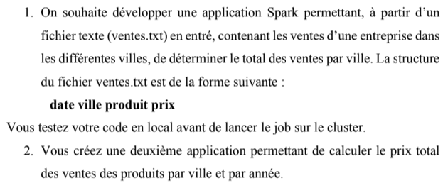
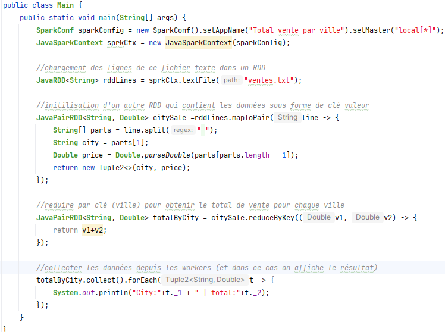
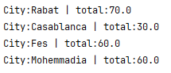
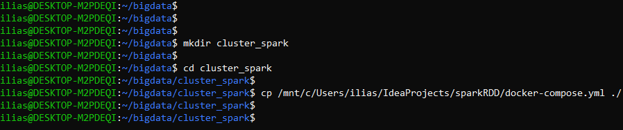
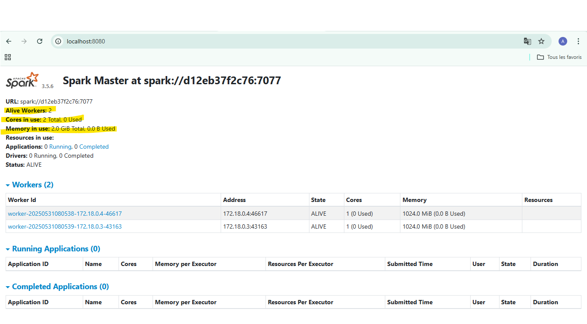
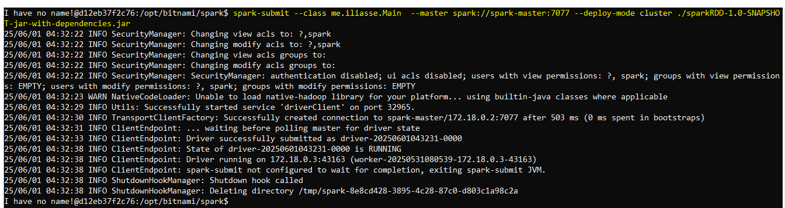
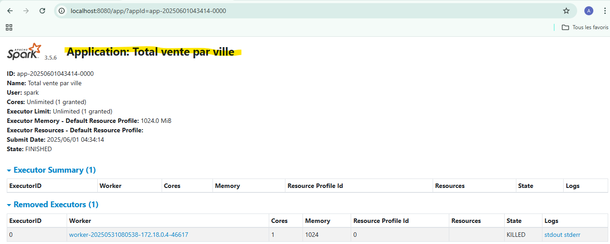

<h2>Programmation des RDDs (Resilient distributed Datasets)</h2>

Objectif du TP :

<h4>1 - total des ventes par ville (teste de l'application en local) : </h4>

Résultat :

<h4>2 - Deploiment de l'application sur un cluser spark (le fichier docker-compose.yml est fourni dans la racine du projet) : </h4>

Voici les étapes à suivre : 

1 - Créer un dossier sur votre machine (exp cluser-spark) , déplacer dans ce dossier le fichier docker-compose.yml

 

2 - Taper la commande suivante pour lancer les conteneurs (les services mentionnés dans docker-compose.yml)

 

3 - Si tous est bien passer vous pouvez consulter http://localhost:8080 qui est l'interface web du conteneur spark-master,
dont vous trouverai des informations générales sur votre cluster

 

4 - Déploiment de l'application sur ce cluster spark

 

5 - A ce state toutes les taches (transformations et action) ont terminé leurs execution, et notre application "Total vente par ville" a était créée

